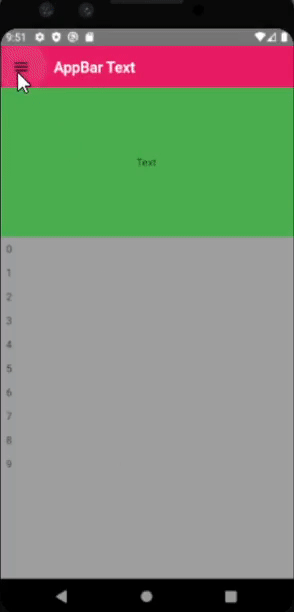
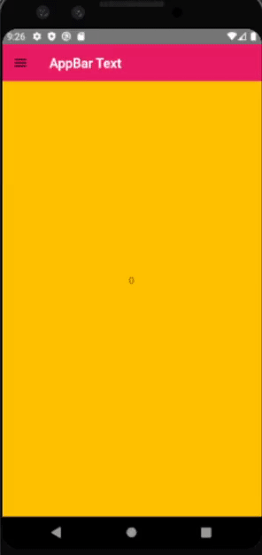
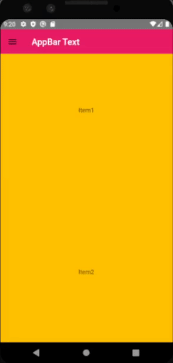
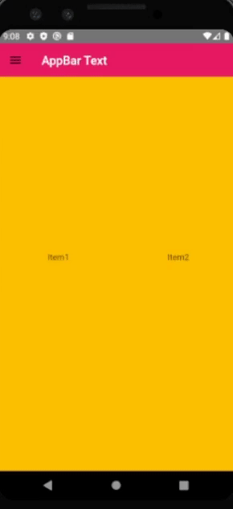

This package provides you 3d flip effect while dragging both horizontally(for drawer) and vertically(for content).

## Installation

1.  Add the latest version of package to your pubspec.yaml 

        dependencies:
          flip_drawer_3d: ^0.0.1

2.  Import the package and use it in your Flutter app

        import 'package:flip_drawer_3d/flip_drawer_3d.dart';
    
## Usage

      @override
      Widget build(BuildContext context) {
        return MaterialApp(
          debugShowCheckedModeBanner: false,
          home: FlipDrawer3D(
              appBar: (context, controller, controller2) => CustomAppBar(
                    color: Colors.pink,
                    horizontalController: controller,
                    verticalController: controller2,
                    title: Text('AppBar Text'),
                  ),
              mainPage: (context, controller, controller2, controller3) => CustomNormalView(
                    child: Column(
                      children: [
                        Container(color: Colors.green, height: 200, child: Center(child: Text('Text'))),
                        Expanded(
                            child: ListView.builder(
                          itemCount: 10,
                          itemBuilder: (context, index) => Padding(
                            padding: const EdgeInsets.all(8.0),
                            child: Text(index.toString()),
                          ),
                        ))
                      ],
                    ),
                  ),
              contentPage: (context, controller) => Container(
                    color: Colors.pink,
                  ),
              drawer: CustomDrawer(
                backgroundColor: Colors.blue,
                child: Column(),
              )),
        );
      }
 

## Example

1. PageView.custom example

        FlipDrawer3D(
                  appBar: (context, controller, controller2) => CustomAppBar(
                        color: Colors.pink,
                        horizontalController: controller,
                        verticalController: controller2,
                        title: Text('AppBar Text'),
                      ),
                  mainPage: (context, controller, controller2, controller3) => CustomPageView(
                          pageViewOptions: PageViewOptions(
                            childrenDelegate: SliverChildBuilderDelegate((context, index) => Container(
                                width: 200,
                                height: 200,
                                color: Colors.amber,
                                child: Center(child: Text(index.toString())),
                              )),
                        ),
                      ),
                  contentPage: (context, controller) => Container(
                        color: Colors.pink,
                      ),
                  drawer: CustomDrawer(
                    backgroundColor: Colors.blue,
                    child: Column(),
                  )),

2. ListView example

        FlipDrawer3D(
                  appBar: (context, controller, controller2) => CustomAppBar(
                        color: Colors.pink,
                        horizontalController: controller,
                        verticalController: controller2,
                        title: Text('AppBar Text'),
                      ),
                  mainPage: (context, controller, controller2, controller3) => CustomListView(
                        listViewOptions: ListViewOptions(children: [
                                    Container(
                              child: Center(
                                child: Text('Item1'),
                              ),
                              color: Colors.amber,
                              width: MediaQuery.of(context).size.width / 2,
                              height: MediaQuery.of(context).size.height / 2,
                            ),
                            Container(
                              child: Center(
                                child: Text('Item2'),
                              ),
                              color: Colors.amber,
                              width: MediaQuery.of(context).size.width / 2,
                              height: MediaQuery.of(context).size.height / 2,
                            ),
                            Container(
                              child: Center(
                                child: Text('Item3'),
                              ),
                              color: Colors.amber,
                              width: MediaQuery.of(context).size.width / 2,
                              height: MediaQuery.of(context).size.height / 2,
                            ),
                        ]
                            ),
                      ),
                  contentPage: (context, controller) => Container(
                        color: Colors.pink,
                      ),
                  drawer: CustomDrawer(
                    backgroundColor: Colors.blue,
                    child: Column(),
                  )),

3. ListView.builder example

        FlipDrawer3D(
                  appBar: (context, controller, controller2) => CustomAppBar(
                        color: Colors.pink,
                        horizontalController: controller,
                        verticalController: controller2,
                        title: Text('AppBar Text'),
                      ),
                  mainPage: (context, controller, controller2, controller3) => CustomListView(
                        listViewOptions: ListViewOptions(
                            itemCount: 5,
                            itemBuilder: (p0, p1) => Container(
                                  width: 200,
                                  height: 200,
                                  color: Colors.amber,
                                  child: Center(child: Text('Item${p1+1}')),
                                ),
                            scrollDirection: Axis.horizontal),
                      ),
                  contentPage: (context, controller) => Container(
                        color: Colors.pink,
                      ),
                  drawer: CustomDrawer(
                    backgroundColor: Colors.blue,
                    child: Column(),
                  )),

## Additional information

Don't hesitate to contribute. Any help would be appreciated !
